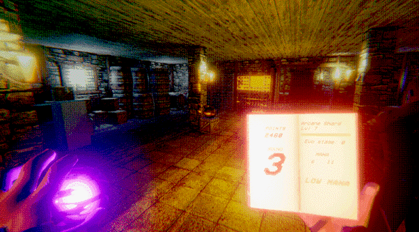
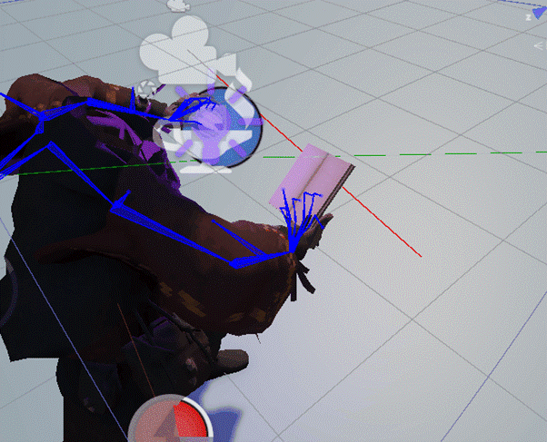
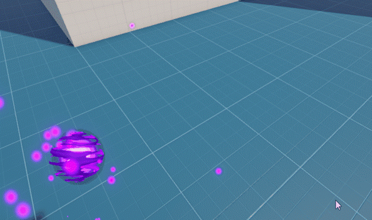
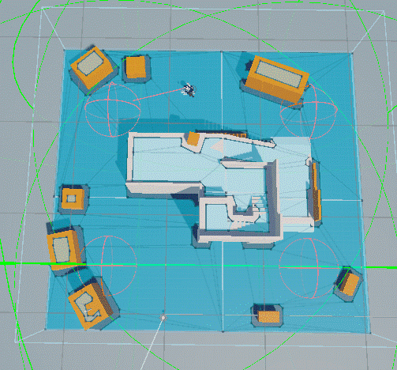
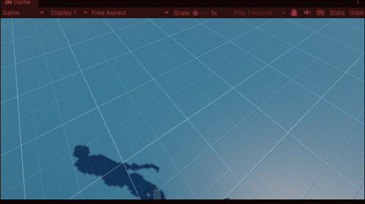
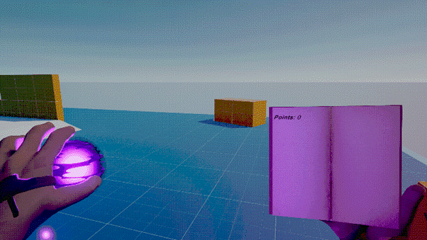

# Wraithspeller

**Wraithspeller** is a first-person wave-based survival game developed in **Unity**. Players take on the role of a mage who must fend off undead hordes using dynamic spells, a weapon progression system, and a diegetic UI integrated into a magical grimoire.

---

## Technical Specifications

### Player Controller and Movement
* **Input System:** Built using the Unity Input System package to allow for rebindable controls and improved cross-platform compatibility.
* **Procedural Body Rendering:** The player model is fully rendered to project accurate shadows. A custom shader setup manages material transparency for the head and arms to prevent camera clipping while maintaining shadow casting.
* **Movement Mechanics:** Includes a stamina-based sprinting system and a dash mechanic for evasion.

### Combat and VFX
* **Magic Orb System:** Created using a combination of billboard planes and particle systems. It utilizes "Set Color over life" for pulsing effects and random turbulence for magical instability.
* **Object Pooling:** Projectiles are managed via an object pooling system to minimize memory allocation and garbage collection overhead during intense combat.
* **Collision Matrix:** Custom physics layers prevent projectile-player clipping, ensuring spells originate correctly from the camera center without colliding with the player's own hitbox.

### AI and Wave Management
* **Zombie Intelligence:** Agents utilize NavMesh for navigation. The AI logic includes a "Search and Destroy" behavior where enemies patrol a randomized area around the player before engaging in a direct chase.
* **Wave Controller:** * Dynamic difficulty scaling: Enemy health and spawn counts increase per round.
    * Optimized Spawning: Spawn points are activated or deactivated based on player proximity and world progression.
    * Hard cap of 50 active agents to maintain performance stability.

---

## Diegetic Interface (The Grimoire)
The user interface is integrated directly into the game world through the player's book:
* **Real-time Stats:** Tracks score, round number, and weapon experience.
* **Inventory System:** Allows for weapon switching and interaction, with the book's pages updating automatically to reflect the current equipment.
* **Procedural Animation:** Hand placements are calculated using **Inverse Kinematics (IK)** to ensure the character's hands realistically grip the book and the magic orb regardless of movement.

---

## Development Roadmap

### Completed Milestones
* Implementation of the core movement framework and custom physics configuration.
  
* VFX pipeline for spellcasting and enemy feedback (spawn/death effects).
  
* Interactive environment systems, including point-based door unlocking and NavMesh updates.
* Weapon inventory and experience scaling logic.

### Current Status
* Refining zombie attack hitboxes and randomizing animation states to improve visual variety.
* Optimizing frame rates during high-density waves.

### Planned Features
* Player death state and game-over loop.
* Complete map desing.
* Implementation of a complete sound system with zombie hit, player death, weapon reload, zombies screams sounds.
* Power-up system with match buffs to the player.
* More spells.
* Altar-based power-up weapon evolution system to encourage player to explore the map.
* Expansion of the magic upgrade tree within the grimoire interface.
* Implementation of fog shader to improve the overall aesthetics of the game

---

## Technical Stack
* **Engine:** Unity (Universal Render Pipeline)
* **Modeling/Texturing:** Blender (Node Wrangler workflow and low-res texture baking)
* **Animations:** Mixamo and Procedural IK
* **Version Control:** Git with LFS (Large File Storage) support
